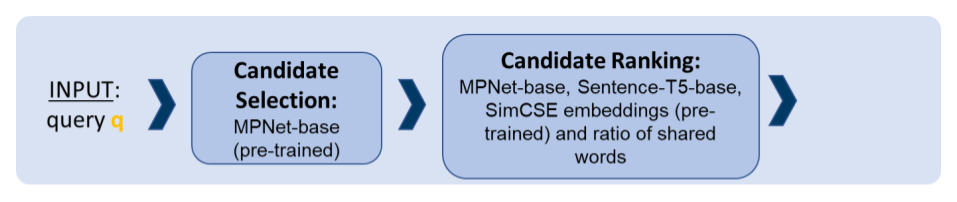

# Tutorial: Fact-Checking a Claim Using SimBa

##  Problem Description: What is the veracity of a claim? Has it been fact-checked before?

Suppose you find this claim in a political debate or online:  
**"Dog-owners face 78% higher risk of catching Covid-19."**  
How can you check whether this claim has already been fact-checked? What evidence did the fact-checkers find for or against it and what was their verdict? Or are there maybe related fact-checks that may help you find relevant evidence concerning this claim?

This tutorial walks you through how to use **SimBa**, a high-performance method that retrieves **fact-checks for similar claims** from **ClaimsKG**, a structured database which serves as a registry of fact-checked claims.


## Preliminaries: What is ClaimsKG?

Fact-checking information has become a crucial endeavor attended to by different initiatives around the globe. Fact-checks are scattered across different portals and are published in a variety of formats. ClaimsKG [https://data.gesis.org/claimskg/] harvests claims, claim reviews and respective metadata from popular fact-checking sites and makes them available in a homogeneous, machine-readable format. 

## Preliminaries: How does SimBa work?

SimBa operates in two steps:
1. candidate retrieval: given an input claim, the 50 most similar claims in the corpus according to embedding-based similarities are selected as candidates.
2. re-ranking: using a combination of different additional features, the candidates are re-ranked and the most similar candidates are returned.




##  Step 1: Install SimBa

```bash
git clone https://github.com/BDA-KTS/detection-of-verified-claims.git
cd detection-of-verified-claims
pip install -r requirements.txt
```

Please refer to the SimBA MethodsHub repository [https://github.com/BDA-KTS/detection-of-verified-claims] for a more extensive guide. 

---

##  Step 2: Prepare Your Input File

First, create a directory in the data subfolder. You can assign any name to it. Let's call it "mydata" for this tutorial. 

```bash
cd detection-of-verified-claims/data
mkdir mydata
cd ..
```

Create a file in your new subfolder:

```
data/mydata/queries.tsv
```

It should contain:

```
1	Dog-owners face 78% higher risk of catching Covid-19.
```

- `1`: the ID for your input claim (from now on called "query"). You can use any number as the ID.
- (`	`): a tab separating the ID and the query text
- `Covid-19 vaccines increase the risk of dying from the new Covid-19 variants`: the query text. Please make sure that it does not contain any tabs or newlines. 
- You can enter an arbitrary number of queries to the file. For this, enter one query per line, each starting with an ID, followed by a tab and a query text. Please make sure that your IDs are unique, i.e. every query has a different ID. 

---


##  Step 3: Run SimBa

```bash
python main.py mydata
```

This compares your query to all claims in the `data/claimsKG/corpus.tsv` file and retrieves the most similar ones. This file contains ~40.000 verified claims from **ClaimsKG**. 

---

##  Step 4: Understanding the Output

You’ll get two output files:

- `data/mydata/pred_client.tsv`: Primary output file
- `data/mydata/pred_qrels.tsv`: CLEF format for automatic evaluation


### Output: `pred_client.tsv`

| Query | VClaim | ClaimReviewURL | Rating | Similarity |
|-------|--------|----------------|--------|------------|
| Covid-19 vaccines increase the risk of dying from the new Covid-19 variants | Getting the first dose of Covid-19 vaccine increases risk of catching the novel coronavirus | https://factcheck.afp.com/misleading-facebook-posts-claim-covid-19-vaccine-increases-risk-catching-novel-coronavirus | b'Misleading' | 45.55524233523532 |
| Covid-19 vaccines increase the risk of dying from the new Covid-19 variants | People vaccinated against Covid-19 pose a health risk to others by shedding spike proteins | https://factcheck.afp.com/covid-19-vaccine-does-not-make-people-dangerous-others | b'False' | 43.15199331134423 |
| Covid-19 vaccines increase the risk of dying from the new Covid-19 variants | Vaccinated people are 885% more likely to die of Covid-19 than unvaccinated people | https://factcheck.afp.com/http%253A%252F%252Fdoc.afp.com%252F9JE74M-2 | b'False' | 42.53184410315937 |
| Covid-19 vaccines increase the risk of dying from the new Covid-19 variants | In the United Kingdom, 70-plus percent of the people who die now from COVID are fully vaccinated. | https://www.politifact.com/factchecks/2021/oct/29/alex-berenson/covid-19-death-rate-england-much-higher-among-unva/ | FALSE | 42.506568861739346 |
| Covid-19 vaccines increase the risk of dying from the new Covid-19 variants | Only the fully vaccinated should fear the new 'worst ever' Covid-19 variant; data shows they already account for 4 in every 5 Covid deaths | https://www.politifact.com/factchecks/2021/dec/07/blog-posting/article-misleads-dangers-omicron-variant-using-uk-/ | FALSE | 42.1289266007539 |


### ❗ Note:

- The **similarity score** ranges from **0 to ~100**, indicating relative similarity based on all employed features.
- You will **always get 5 results** (default), even if the most similar claims do not have a high similarity score.
- The **top-ranked claim is the most similar claim in the database** — it may still be unrelated.

---


##  Optional: Customize the Similarity Method

Edit `main.py` to modify the `retrieval_command` list.

###  Default Behavior

SimBa **first retrieves top-50 candidates** using *one* embedding model (default: `all-mpnet-base-v2`).

Then it **re-ranks** those using:

- **3 different pre-trained sentence embedding models**:
  - `all-mpnet-base-v2`
  - `sentence-t5-base`
  - `unsup-simcse-roberta-base`
- Plus **lexical, referential, and string similarity features**

---

###  Available Similarity Features

| Type | Options | Description |
|------|---------|-------------|
| **Lexical** | `similar_words_ratio`, `similar_words_ratio_length` | Word overlap (excluding stopwords) |
| **Referential** | `spacy_ne_similarity`, `ne_similarity`, `synonym_similarity` | Based on named entities or synonyms |
| **String** | `levenshtein`, `jaccard_similarity`, `sequence_matching` | Raw text similarity |

You can combine them like this:

```python
"-lexical_similarity_measures", "similar_words_ratio",
"-referential_similarity_measures", "spacy_ne_similarity",
"-string_similarity_measures", "levenshtein"
```

---

##  How to Evaluate and Tune Parameters

The feature combination that performs best on CheckThat! benchmarks is 
- Candidate retrieval with MPNet-Base (`all-mpnet-base-v2`)
- Re-ranking with MPNet-Base, SimCSE, Sentence-T5, similar_words_ratio
- braycurtis similarity measure

If you would like to evaluate if for your data, other feature combinations may yield better results, do the following:

### 1. Prepare a goldstandard file (`gold.tsv`) for your query listing correct matches. 


This file should match input queries with verified claims in **TREC qrels format**:
```
<query_id>    0    <correct_claim_id>    1
```

Example:

```
25603    0    59713    1
25603    0    59744    1
```

Save this file in:

```
data/mydata/gold.tsv
```

---
### 2. Run SimBa with the feature combinations you would like to evaluate.
You can configure both the **candidate retrieval** and the **re-ranking** settings in `main.py`:

```python
retrieval_command = [
  ...
  "-sentence_embedding_models", "all-mpnet-base-v2",
  "-lexical_similarity_measures", "similar_words_ratio",
  "-referential_similarity_measures", "spacy_ne_similarity",
  "-string_similarity_measures", "levenshtein",
  "--similarity_measure", "braycurtis"
]
```

Then run:

```bash
python main.py mydata
```

This will create:

```
data/mydata/pred_qrels.tsv
```

---
### 3. Use CLEF's evaluation script to compute MAP@k scores.   
#### Clone the CLEF CheckThat! Lab 2020 repository

```bash
git https://github.com/sshaar/clef2020-factchecking-task2
cd clef2020-factchecking-task2
```

#### Run the evaluation script

```bash
python evaluate.py \
  --scores /path/to/data/mydata/pred_qrels.tsv \
  --gold-labels /path/to/data/mydata/gold.tsv \
  --metrics map --metrics precision --metrics reciprocal_rank \
  --depths 1 --depths 3 --depths 5 \
  -o results.tsv
```

This will produce metrics like:

- **MAP@1**, **MAP@3**, **MAP@5**
- **Precision@k**
- **MRR@k**

Use these metrics to test different combinations and optimize performance.

---

##  Fast Reruns

Use `-c` to reuse cached embeddings for your corpus:

```bash
python main.py sample -c
```

You may do so whenever you are repeatedly working with the same corpus of previously fact-checked claims. SimBa will compute the embeddings once, store and reuse them. When you want to use a different corpus than for your previous SimBa call, do not use the cached embeddings of the previously used corpus. 

---

##  Further Reading

- Hövelmeyer, Alica, Katarina Boland, and Stefan Dietze. 2022. *SimBa at CheckThat! 2022: Lexical and Semantic Similarity-Based Detection of Verified Claims in an Unsupervised and Supervised Way.* In: CEUR Workshop Proceedings, Vol. 3180, pp. 511–531. [PDF](https://ceur-ws.org/Vol-3180/paper-40.pdf)

- Boland, Katarina, Hövelmeyer, Alica, Fafalios, Pavlos, Todorov, Konstantin, Mazhar, Usama, & Dietze, Stefan. 2023. *Robust and Efficient Claim Retrieval for Online Fact-Checking Applications.* Preprint. [DOI](https://doi.org/10.21203/rs.3.rs-3007151/v1)

---

##  Need Help?

Contact: [katarina.boland@hhu.de](mailto:katarina.boland@hhu.de)


